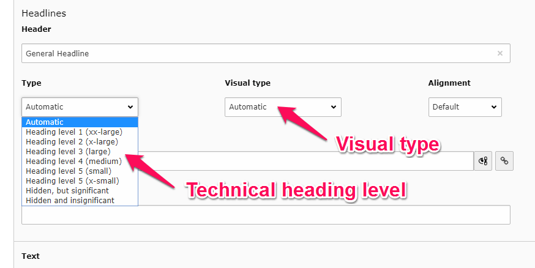

# tw_base

> Basic building blocks for TYPO3 projects

## Heading view helper

```html
<base:heading level="1" type="2" content="First headline on page"/>
```

The heading view helper aims to replace any hardcoded use of `<h1>`, `<h2>`, etc. with a dynamic creating of heading levels. It uses these attributes:

| Attribute | Type    | Mandatory | Description                                                                                       | Default |
|:----------|:--------|:---------:|:--------------------------------------------------------------------------------------------------|:--------|
| `content` | Text    |    Yes    | The heading text; may contain HTML markup                                                         |         |
| `level`   | Integer |    No     | If present and a positive number (1-6), this will be used as the technical heading level. If omitted or zero, the heading level will be determined automatically. Only one `<h1>` will be generated except when forced with non-zero `level` value. If a heading level is forcibly skipped, the CSS class `Heading--semantic-error` will be added to the heading. | `null`  |
| `type`   | Integer |    No     | Visual heading type. If omitted or zero, the technical heading level will be used as visual type. The visual heading type will result in one of the [type CSS classes](#visual-type-css-classes). | `1`  |

### Usage


### Visual type CSS classes

* `Heading--xx-large`  (corresponds to `<h1>`)
* `Heading--x-large` (corresponds to `<h2>`)
* `Heading--large` (corresponds to `<h3>`)
* `Heading--medium` (corresponds to `<h4>`)
* `Heading--small` (corresponds to `<h5>`)
* `Heading--x-small` (corresponds to `<h6>`)

In addition, the heading has the CSS class `Heading--hidden` if it shouldn't be rendered visually (see below).

### Backend integration

Both the technical heading `level` as well as the visual heading `type` can be set by editors in the backend:



The extension also introduces two different kind of *hidden* headings:

* **Hidden, but in outline**: These headings will be rendered but they'll carry the additional CSS class `Heading--hidden` to indicate that they should be [visually hidden](https://a11yproject.com/posts/how-to-hide-content/). You can use this to keep the heading outline in order without really displaying anything.
* **Hidden**: These headings won't be rendered in the frontend but you will still see their content in the pages view in the TYPO3 backend.
